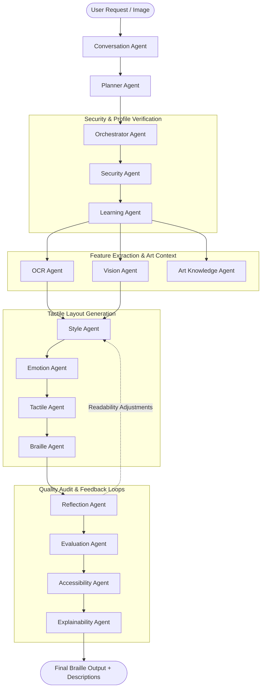

# ⠃⠗⠁⠊⠇⠇⠑⠠⠁⠗⠞ ⠠⠁⠊ (BrailleArt AI)

BrailleArt AI is a production-ready AI agent system designed for Kaggle's **AI Agents: Intensive Vibe Coding Capstone** under the **Agents for Good** track. It leverages advanced vision-language models, specialized tools, and the Model Context Protocol (MCP) to analyze, transcribe, and convert visual imagery, text, and user concepts into highly detailed Braille art representations. By making digital imagery tactile and accessible, BrailleArt AI aims to serve the visually impaired community and advance accessible AI agents.

---

## 🚀 Key Technologies
*   **Python**: Core programming language.
*   **Google Gen AI ADK**: High-performance agent orchestration client utilizing the Gemini SDK.
*   **Gemini 2.5 Flash**: Multi-modal intelligence used for visual reasoning and creative text-to-tactile generation.
*   **FastAPI**: Production-grade async backend serving REST endpoints.
*   **Streamlit**: Vibrant and modern frontend dashboard for end-user interaction.
*   **SQLite + SQLAlchemy**: Lightweight database layer for logging prompts, user configurations, audit logs, and generated Braille artwork.
*   **Docker**: Isolated, containerized packaging for seamless local and cloud deployment.
*   **FastMCP**: MCP server hosting specialized tools that other agents can consume.

---

## 📁 Project Structure

The project has been initialized with the following production-ready layout:

```text
BrailleArt-AI/
├── .env.example              # Environment variables template
├── .gitignore                # Git ignore configuration
├── Dockerfile                # Production-grade multi-stage container build
├── README.md                 # Project documentation (this file)
├── requirements.txt          # Production and development dependencies
└── src/                      # Application source directory
    ├── agents/               # AI Agent definitions and prompts using Google ADK
    │   ├── __init__.py
    │   └── braille_agent.py
    ├── backend/              # FastAPI Application & REST APIs
    │   ├── __init__.py
    │   ├── main.py
    │   └── router.py
    ├── database/             # SQLite connection, session managers, and models
    │   ├── __init__.py
    │   ├── db.py
    │   └── models.py
    ├── frontend/             # Streamlit Dashboard UI
    │   ├── __init__.py
    │   └── app.py
    ├── mcp/                  # FastMCP server exposing tools to other agents
    │   ├── __init__.py
    │   └── server.py
    ├── tools/                # Specialized modular tools (text/image-to-braille converters)
    │   ├── __init__.py
    │   └── braille_tool.py
    └── utils/                # Logging configs and general helper scripts
        ├── __init__.py
        └── helpers.py
```

---

## 🛠️ Getting Started

### Prerequisites
*   Python 3.11+
*   Docker (Optional, for containerized run)
*   Gemini API Key

### Local Installation

1.  **Clone and navigate to the project directory:**
    ```bash
    cd BrailleArt-AI
    ```

2.  **Create and activate a virtual environment:**
    ```bash
    python -m venv .venv
    # Windows:
    .venv\Scripts\activate
    # macOS/Linux:
    source .venv/bin/activate
    ```

3.  **Install dependencies:**
    ```bash
    pip install -r requirements.txt
    ```

4.  **Configure environment variables:**
    ```bash
    copy .env.example .env
    # Edit .env and enter your GEMINI_API_KEY
    ```

---

## 🏃 Running the Services

You can run the different components of BrailleArt AI separately:

### 1. Run the FastAPI Backend
Start the FastAPI server for data models and API services:
```bash
uvicorn src.backend.main:app --reload --host 127.0.0.1 --port 8000
```
*API docs will be available at `http://127.0.0.1:8000/docs`.*

### 2. Run the Streamlit Frontend
Launch the Streamlit interactive UI dashboard:
```bash
streamlit run src/frontend/app.py --server.port 8501
```
*Open your browser and navigate to `http://localhost:8501`.*

### 3. Run the FastMCP Server
Expose specialized Braille tools to any MCP client/agent host:
```bash
fastmcp run src/mcp/server.py --port 8012
```

---

## 🤖 Multi-Agent Architecture & Workflow

BrailleArt AI implements a comprehensive multi-agent system built using the Google Gen AI Agent Development Kit (ADK). This architecture allows the platform to decompose visual processing, safety, stylization, accessibility, and quality auditing into isolated specialist roles.

### Workflow Diagram



### Agent Roles & Responsibilities

1.  **Planner Agent (`planner.py`)**: Analyzes incoming prompts and coordinates the sequence of sub-agent calls needed to fulfill the request.
2.  **Orchestrator Agent (`orchestrator.py`)**: Runs the pipeline, handling data flow, executing individual step tasks, and synthesizing outcomes.
3.  **Security Agent (`security.py`)**: Validates uploads, checks MIME types, limits payload sizes, and strips Exif/privacy metadata.
4.  **Vision Agent (`vision.py`)**: Examines images using multi-modal capabilities, mapping foreground/background structures and shape boundaries.
5.  **OCR Agent (`ocr.py`)**: Extracts textual symbols and text coordinates from visual labels so they are translated rather than drawn as lines.
6.  **Style Agent (`style.py`)**: Computes line widths, dithering configurations, contrast thresholds, and dot textures.
7.  **Emotion Agent (`emotion.py`)**: Analyzes artistic mood or theme, recommending spacing or density changes to convey the emotional tone.
8.  **Art Knowledge Agent (`art_knowledge.py`)**: Identifies fine art, artists, historical contexts, symbolism, and similar works to educate the user.
9.  **Accessibility Agent (`accessibility.py`)**: Formulates alt text, Easy English versions, child-friendly descriptions, screen-reader details, and audio narration scripts.
10. **Evaluation Agent (`evaluation.py`)**: Measures output quality and visual-to-tactile alignment, scoring fidelity between input and output.
11. **Braille Agent (`braille.py`)**: Translates standard alphanumeric text into standard Grade 1 or Grade 2 Unified English Braille (UEB) cells.
12. **Tactile Agent (`tactile.py`)**: Groups binarized coordinate grids into 2x4 pixel blocks and maps them to Braille unicode range (U+2800 - U+28FF).
13. **Learning Agent (`learning.py`)**: Adapts output formats, grades, and narration pacing to match user experience level (beginner to advanced).
14. **Conversation Agent (`conversation.py`)**: Exposes a chat interface to the end-user, handling dialog turns and state command overrides.
15. **Reflection Agent (`reflection.py`)**: Self-critiques the generated Braille drawings, detecting errors or cluttered sections before finalization.
16. **Explainability Agent (`explainability.py`)**: Generates system audit reports explaining how each agent calculated its output and why confidence scores were assigned.

---

## 🐳 Docker Deployment

To build and run all services in a single unified container (configured by default for FastAPI backend):

1.  **Build the Docker image:**
    ```bash
    docker build -t brailleart-ai .
    ```

2.  **Run the container:**
    ```bash
    docker run --env-file .env -p 8000:8000 -p 8501:8501 -p 8012:8012 brailleart-ai
    ```

