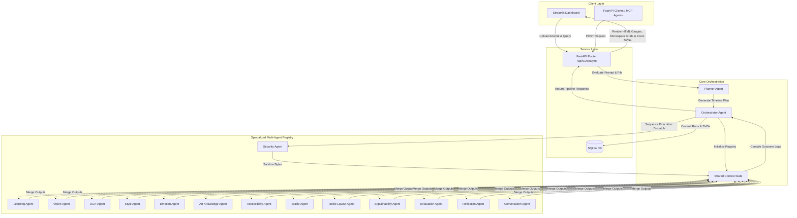

# 🎨 BrailleArt AI: Making Art Accessible Through AI

BrailleArt AI is a production-grade, multi-agent AI system designed to make visual artworks accessible to blind and visually impaired users. It translates image inputs (paintings, sketches, photographs) and text queries into structured accessibility reports, Grade 1/2 Unified English Braille (UEB), and raised-line tactile vector graphics.

This project is built for **Kaggle's AI Agents: Intensive Vibe Coding Capstone** under the **Agents for Good** track.

---

## 🏛️ System Architecture

BrailleArt AI uses a **Dynamic Planning & Orchestration** architecture. When a user submits an artwork and prompt, a specialized Planner Agent dynamically evaluates the payload context to compile an optimized execution timeline. The Orchestrator Agent then executes each step sequentially, passing state updates through a secure Shared Context registry.



---

## 🤖 Specialized Agent Registry

Our multi-agent pipeline is composed of **14 dedicated agent modules** working collaboratively:

| Agent Identifier | File | Responsibility / Operational Mandate |
| :--- | :--- | :--- |
| **Planner** | `planner.py` | Inspects requests and artwork file sizes, dynamically compiling the agent execution plan. Fallbacks on API failures. |
| **Orchestrator** | `orchestrator.py` | Chronologically executes steps, computes execution timelines, and manages SQLite log writes. |
| **Security** | `security.py` | Sanitizes filenames, verifies magic-bytes matching, and strips privacy-invading GPS/EXIF metadata. |
| **Learning** | `learning.py` | Adaptively tunes the vocabulary complexity and recommended Braille grades based on the educational setting. |
| **Vision** | `vision.py` | Analyzes image content, mapping shapes, boundaries, contours, lighting styles, and perspective ratios. |
| **OCR** | `ocr.py` | Performs multilingual text extraction from images, translating foreign annotations into English. |
| **Style** | `style.py` | Recommends aesthetic configurations (shading dot densities, edge thickness rules, cell mapping techniques). |
| **Emotion** | `emotion.py` | Evaluates mood, color psychology, and symbolic atmosphere to guide tactile representation pacing. |
| **Art Knowledge** | `art_knowledge.py`| Identifies famous artworks, providing historical context, artist profiles, and symbolism dossiers. |
| **Accessibility** | `accessibility.py`| Compiles the final accessibility report containing screen reader scripts, child versions, and alt text. |
| **Braille** | `braille.py` | Translates descriptions into Grade 1, Grade 2 contracted, and Unicode Braille character patterns. |
| **Tactile Layout** | `tactile.py` | Generates inline Simplified SVGs and dot/dash Embosser-Ready SVGs representing artwork outlines. |
| **Explainability** | `explainability.py`| Outlines reasoning maps and generates confidence justifications for choices made at each pipeline phase. |
| **Evaluation** | `evaluation.py` | Reviews generated graphics, grading visual-to-tactile alignment to check for aspect ratio warp. |
| **Reflection** | `reflection.py` | Analyzes generated grids to avoid dot-overcrowding or isolated floating dot errors. |
| **Conversation** | `conversation.py` | Directs natural language chat dialogs, parsing user preference overrides. |

---

## 🔌 API Reference

The FastAPI backend exposes endpoints for programmatic multi-agent orchestration.

### 1. Analyze Pipeline Endpoint
- **URL**: `/api/v1/analyze`
- **Method**: `POST`
- **Content-Type**: `multipart/form-data`

#### Request Parameters:
- `prompt` (form field, string): User query or translation request.
- `file` (form file upload, optional): Image payload of the artwork (< 10MB, PNG/JPEG).

#### Example Response (`200 OK`):
```json
{
  "success": true,
  "final_output": "<svg ...>...</svg>",
  "trace": [
    {
      "agent": "security",
      "status": "completed",
      "execution_time_ms": 12,
      "error_message": null
    },
    {
      "agent": "vision",
      "status": "completed",
      "execution_time_ms": 1152,
      "error_message": null
    }
  ],
  "shared_context": {
    "user_prompt": "Analyze starry night",
    "has_image": true,
    "image_metadata": {
      "filename": "starry_night.jpg"
    },
    "vision": {
      "confidence_score": 0.98,
      "spatial_layout_description": "A dark blue night sky with swirling yellow stars..."
    },
    "accessibility": {
      "alt_text": "Swirling yellow stars over a sleeping village...",
      "accessibility_score": {
        "completeness": 0.95,
        "readability": 0.92,
        "usefulness": 0.96,
        "screen_reader_compatibility": 0.95,
        "overall_score": 0.945
      }
    }
  }
}
```

### 2. Service Health Check
- **URL**: `/health`
- **Method**: `GET`
- **Response**: `{"status": "ok", "service": "BrailleArt AI Backend"}`

---

## 🛠️ Developer Setup & Installation Guide

### Prerequisites
- Python 3.11 or later
- Valid **Gemini API Key** (for Google Gen AI ADK)

### Step 1: Clone the Repository & Configure Virtualenv
```powershell
# Clone code
git clone https://github.com/prasannasabhahit24/BrailleArt-AI.git
cd BrailleArt-AI

# Create virtual environment
python -m venv .venv
.venv\Scripts\activate
```

### Step 2: Install Project Dependencies
```powershell
pip install -r requirements.txt
```

### Step 3: Configure Environment
Copy `.env.example` to `.env` and populate your credentials:
```env
GEMINI_API_KEY=AIzaSyYourGeminiApiKeyHere
DATABASE_URL=sqlite:///./braille_art.db
LOG_LEVEL=INFO
DB_ECHO=False
```

### Step 4: Run Services
To run both backend and frontend servers locally on Windows, execute in separate terminals:

```powershell
# Terminal 1: Backend Server (FastAPI)
python -m uvicorn src.backend.main:app --host localhost --port 8000

# Terminal 2: Dashboard Frontend (Streamlit)
python -m streamlit run src/frontend/app.py --server.port 8501
```
Open **`http://localhost:8501`** in your browser to interact with the dashboard.

### Step 5: Execute Test Suite
```powershell
python -m pytest
```

---

## 🐳 Production Deployment Guide (Docker)

Our Docker deployment is optimized for container security and configuration flexibility.

### 1. Build Docker Image
```bash
docker build -t brailleart-ai:latest .
```

### 2. Configure Service Roles
The Docker container uses `entrypoint.sh` to route execution dynamically depending on the `SERVICE_TYPE` environment variable.

#### Deploy Backend Only (e.g. API Node / ECS Backend Task)
```bash
docker run -d \
  -p 8000:8000 \
  -e GEMINI_API_KEY="AIzaSy..." \
  -e SERVICE_TYPE="backend" \
  brailleart-ai:latest
```

#### Deploy Frontend Only (e.g. App Runner / Streamlit Web Node)
```bash
docker run -d \
  -p 8501:8501 \
  -e BACKEND_URL="https://your-api-domain.com" \
  -e SERVICE_TYPE="frontend" \
  brailleart-ai:latest
```

#### Deploy MCP Server Only
```bash
docker run -d \
  -p 8012:8012 \
  -e GEMINI_API_KEY="AIzaSy..." \
  -e SERVICE_TYPE="mcp" \
  brailleart-ai:latest
```

#### Deploy All Services Concurrently (Single-Node Sandbox)
```bash
docker run -d \
  -p 8000:8000 \
  -p 8501:8501 \
  -e GEMINI_API_KEY="AIzaSy..." \
  -e SERVICE_TYPE="all" \
  brailleart-ai:latest
```

### 🔒 Security Implementations in Docker:
- **Least Privilege Principle**: The runner stage does not execute as `root`. It runs under a dedicated `appuser` (UID `10001`), protecting the host from container escape exploits.
- **Write Permissions**: Ownership of `/app` is recursively chowned to `appuser` at build-time to support dynamic file writing for generated SVGs (`/app/outputs/`) and SQLite state allocations.
- **Dependency Isolation**: All pip modules are pre-compiled and run inside isolated virtual environments (`/opt/venv`).

---

## 💾 Database Schemas

SQLite database mappings are structured inside `src/database/models.py`:

```sql
-- Represents individual conversation/pipeline runs
CREATE TABLE agent_conversations (
    id INTEGER PRIMARY KEY AUTOINCREMENT,
    session_id VARCHAR NOT NULL,
    user_prompt VARCHAR NOT NULL,
    agent_response VARCHAR NOT NULL,
    created_at DATETIME DEFAULT CURRENT_TIMESTAMP,
    meta_logs JSON NOT NULL
);

-- Represents generated Braille translations and SVGs
CREATE TABLE saved_art (
    id INTEGER PRIMARY KEY AUTOINCREMENT,
    art_type VARCHAR NOT NULL, -- 'text' or 'image'
    source_content VARCHAR NOT NULL,
    braille_content VARCHAR NOT NULL,
    config_params JSON NOT NULL,
    created_at DATETIME DEFAULT CURRENT_TIMESTAMP
);
```

---

## ♿ Accessibility Standards Alignment

BrailleArt AI implements concrete accessibility features matching W3C WAI-ARIA and tactile graphic standards:

1. **High Contrast Display**: Streamlit dashboard components utilize a high contrast theme targeting `ratio >= 7:1` to ensure readable borders and typography for low-vision users.
2. **Text-To-Speech (TTS)**: Built-in narration buttons leverage browser-native Web Speech API (`window.speechSynthesis`) with client-side speech rate controllers (0.5x to 2.0x).
3. **Downloadable Monospace Files**: Braille character strings are exported as `.txt` files in UTF-8, ensuring NVDA, JAWS, and refreshable Braille displays read cells accurately without layout shifting.
4. **SVG Coordinate Lists**: SVGs generated by the Tactile Agent contain precise bounding coordinates to allow screen-readers to list relative directions and positioning of detected elements.
5. **Dynamic Scaling**: Custom layout variables dynamically resize layout fonts without breaking page responsive grids.
